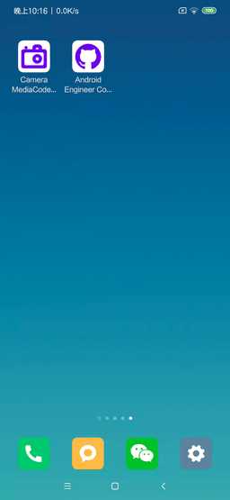

# 株式会社ゆめみ Android エンジニアコードチェック課題

## 概要

 1. GitHub のリポジトリを検索するアプリを完備させる

 2. Camera２とMediaCodecとMediaRecordreとAudioRecordとAudioTrack、Androidに基づいてのマルチメディア技術のアプリを完備させる

## アプリ仕様

GitHub のリポジトリを検索するアプリ

Camera２、MediaCodec、MediaRecorder、AudioRecord、AudioTrackの効果

### 動作

1. 何かしらのキーワードを入力
2. GitHub API（`search/repositories`）でリポジトリを検索し、結果一覧を概要（リポジトリ名）で表示
3. 特定の結果を選択したら、該当リポジトリの詳細（リポジトリ名、オーナーアイコン、プロジェクト言語、Star 数、Watcher 数、Fork 数、Issue 数）を表示

## 課題取り組み方法

コードチェックの課題 Issue は全て [`課題`](https://github.com/yumemi-inc/android-engineer-codecheck/milestone/1) Milestone がついており、難易度に応じて Label が [`初級`](https://github.com/yumemi-inc/android-engineer-codecheck/issues?q=is%3Aopen+is%3Aissue+label%3A初級+milestone%3A課題)、[`中級`](https://github.com/yumemi-inc/android-engineer-codecheck/issues?q=is%3Aopen+is%3Aissue+label%3A中級+milestone%3A課題+) と [`ボーナス`](https://github.com/yumemi-inc/android-engineer-codecheck/issues?q=is%3Aopen+is%3Aissue+label%3Aボーナス+milestone%3A課題+) に分けられています。課題の必須／選択は下記の表とします。

|   | 初級 | 中級 | ボーナス
|--:|:--:|:--:|:--:|
| 新卒／未経験者 | 必須 | 選択 | 選択 |
| 中途／経験者 | 必須 | 必須 | 選択 |

